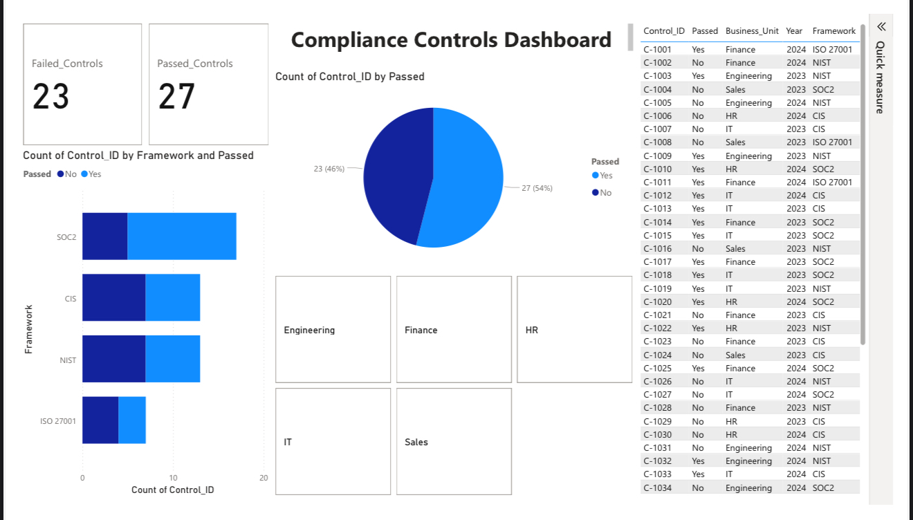

# Compliance Controls Dashboard

**Interactive Power BI Dashboard for Real-World Audit Tracking, Framework Coverage, and Compliance Posture Visibility**

> "Built to empower GRC teams, CISOs, and auditors with real-time insight into audit coverage, control failures, and compliance health — across business units, frameworks, and functions."

---

## What This Project Solves

Modern organizations juggle multiple compliance frameworks (CIS, NIST, ISO 27001, SOC2) while struggling with:
- Scattered control tracking
- Audit fatigue
- Missed gaps in framework coverage
- Siloed compliance data

This dashboard provides **real-time clarity** into:
- **Control pass/fail rates**
- **Compliance posture by business unit**
- **Framework-specific gaps**
- **Control mapping and audit visibility**

---

## Use Case

- **Audit & Compliance Reporting** for CISOs, GRC leads, and risk managers
- **Live Control Health Tracking** across NIST, ISO 27001, CIS, and SOC2
- **Compliance Readiness Training** for junior GRC interns or analyst candidates
- **Executive Briefing Tool** for board-level audit metrics and framework trends

---

## Audience

- GRC & Compliance Managers  
- Internal & External Auditors  
- CISOs and Risk Officers  
- Cybersecurity Students in Governance tracks  
- Cloud Governance Teams or DevSecOps compliance stakeholders

---

## Dashboard Preview

| **Metric** | **What It Shows** | **Why It Matters** |
|------------|-------------------|---------------------|
| **Passed vs Failed Controls** | Real-time control audit outcomes | Measure compliance posture, identify risk |
| **Control Count by Framework** | Breakdown of coverage by CIS, NIST, ISO, SOC2 | Show framework-specific gaps |
| **Business Unit Mapping** | Passed/failed controls by unit (e.g. Sales, HR, IT) | Pinpoint org-level compliance weak points |
| **Control ID Filter** | Deep dive into specific failed controls | Track remediation and RCA (root cause analysis) |
| **Interactive Framework Filter** | Toggle between frameworks | Executive-level filtering & reporting |

---

## Key Skills Demonstrated

- **Power BI:** Advanced visuals, DAX metrics, filters, slicers, matrix layouts
- **GRC Analytics:** Control mapping, pass/fail classification, audit tracking
- **Dashboard Design:** Framework segmentation, high-level overviews, business-unit insights
- **Compliance Ops:** Mapping real frameworks to visual reporting
- **Communication:** STAR-format storytelling for audit & security metrics

---

## Core Compliance Concepts

| **Term** | **Definition** |
|---------|----------------|
| **Control ID** | Unique identifier tied to a specific security/audit control |
| **Framework Mapping** | Assigning a control to one or more industry frameworks (e.g. NIST AC-1, ISO A.9.2) |
| **Pass/Fail Status** | Audit result of whether control meets required standard |
| **Business Unit** | Organizational division tied to a control (e.g. IT, Sales, HR) |
| **Compliance Posture** | Real-time health of control coverage across frameworks and org |

---

## How to Use It

1. Open the `.pbix` file in Power BI Desktop  
2. Filter by **Framework**, **Business Unit**, or **Pass/Fail**  
3. Explore real-time control health and identify framework gaps  
4. Export audit summary for executive reports or board reviews  
5. Train new GRC team members by reviewing failed control patterns

---

## Expansion Ideas

- Add control owner field to show **accountable parties**  
- Link to **SOAR Playbooks** for failed control remediation  
- Add **automated control status updates** from external systems (e.g. ServiceNow, Jira, SOAR, Excel imports)  
- Add **timeline filters** for monthly/quarterly compliance drift tracking

---

## Live Demo (Coming Soon)

This dashboard will soon be embedded live via Power BI Web Embed for full interactivity in-browser.

---

## License

MIT — free to use, remix, and build on with credit.

---

## Built With Purpose

Created to simulate real-world GRC workflows, streamline compliance audits, and empower security governance with actionable insights.  
Built by [Dylan Leonard](https://github.com/dylanleonard-1) — Cybersecurity Engineer | Security Automation Architect | GRC Enthusiast
